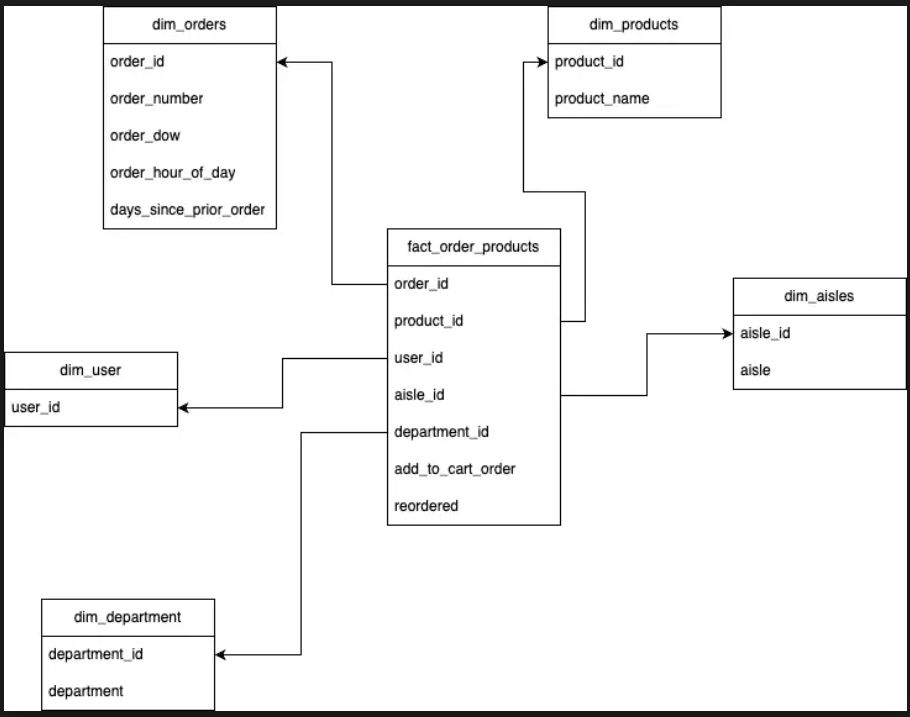

# Instacart Data Engineering Project

## Overview
This project demonstrates a basic data engineering pipeline using AWS S3, Snowflake, and Visio for data modeling. The dataset is sourced from [Kaggle's Instacart Dataset](https://www.kaggle.com/competitions/instacart-market-basket-analysis/data) and follows an ETL process to create a STAR schema for analytics.

## Data Pipeline Steps
1. **Extract**: Upload Instacart CSV files to an AWS S3 bucket.
2. **Load**: Connect Snowflake to the S3 bucket and import CSV data into tables.
3. **Transform**: Create a data modeling diagram in Visio and design a STAR schema.
4. **Analyze**: Perform analytics on the fact and dimension tables in Snowflake.

## Setup and Installation
### **Prerequisites**
- AWS S3 Account & Bucket
- Snowflake Account
- Visio for Data Modeling
- (Optional) Python for automation

## STAR Schema
Here is the STAR schema used in this project:

### **Steps to Run**
1. **Upload Data to S3**: Manually upload CSV files or use `extract_data.py`.
2. **Load Data into Snowflake**:
   - Run `load_to_snowflake.sql` to create and populate tables.
3. **Transform and Model**:
   - Open `star_schema.vsdx` in Visio to view the STAR schema.
   - Run `star_schema.sql` to implement the schema.
4. **Perform Analysis**:
   - Run queries from `analytics.sql` for insights.

## Future Enhancements
- Automate data ingestion using AWS Lambda or Airflow.
- Optimize Snowflake queries for performance.
- Add a dashboard using Power BI or Tableau.

## License
This project is licensed under the MIT License.
